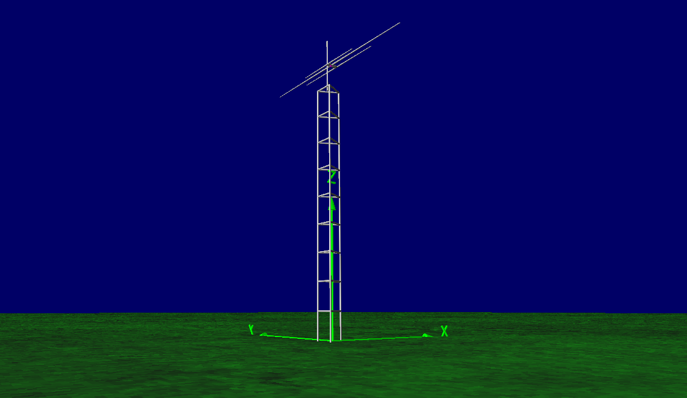
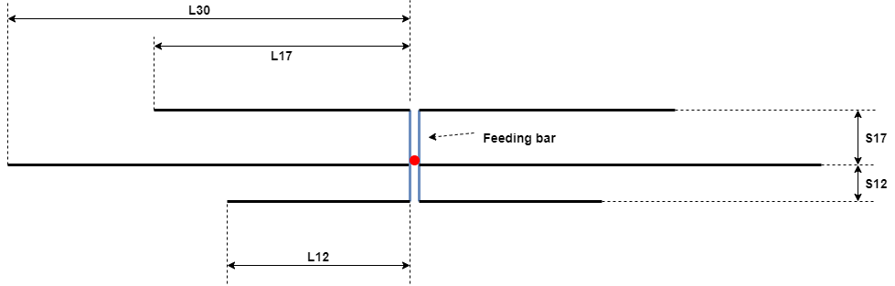
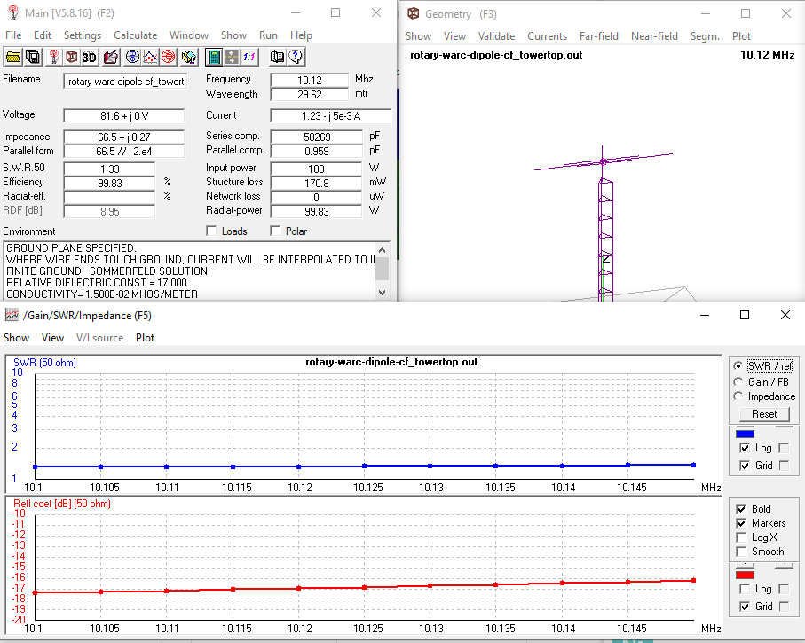
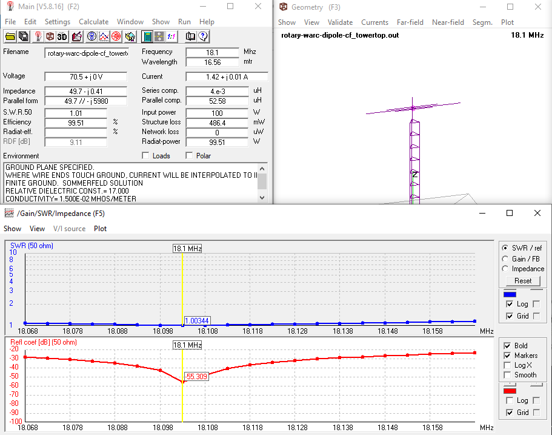
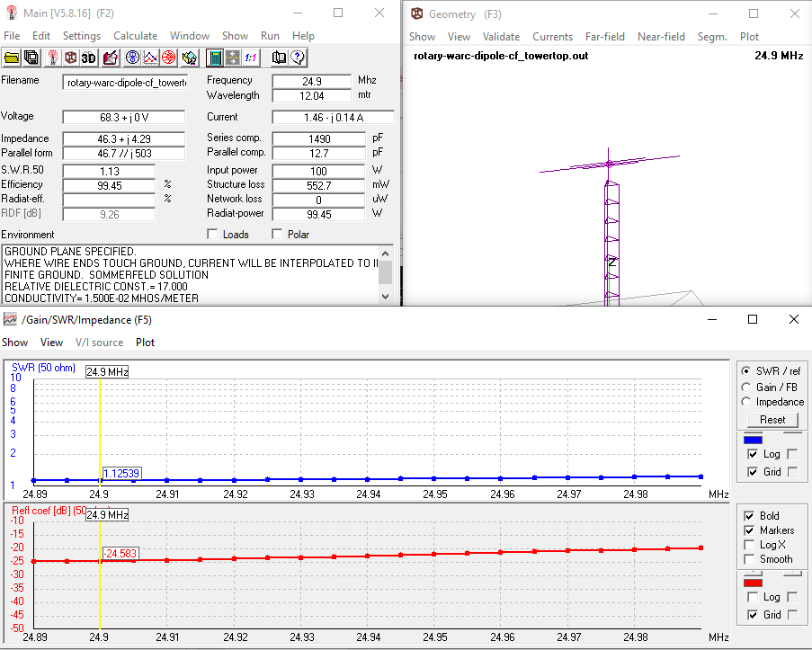
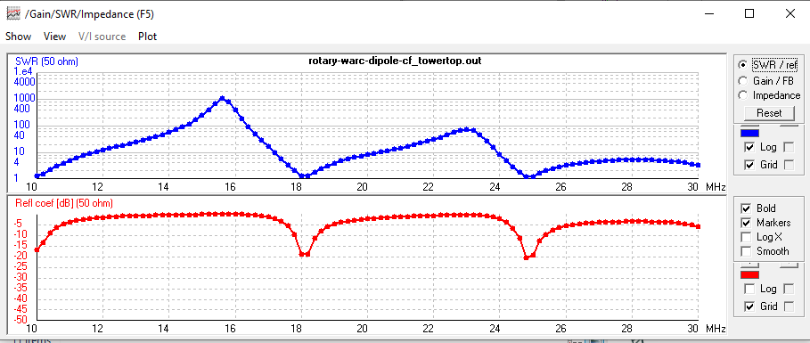

# Rotary WARC Band Dipole Antenna
Here is presented a NEC2 model of WARC Band (30, 17, 12m) Dipole Antenna. The antenna consists of 3 monoband dipoles closely spaced and fed from a common feed point. This approach is chosen to deliver maximum bandwidth at each band, even though this is not a strictly necessary since the amateur band plan is quite narrow at each band. The simulation is done at height of 20m above the ground. The simulation shows that at 17 and 12m, it is possible to achieve near perfect VSWR (below 1.1:1) and good VSWR (below 1.5:1) at 30m band.

## Dimensions
The picture below will tell thousands words. Please left click / right click + open in new tab for the full view of the picture.

|**Parameters**          |**Dimension**      |**Comment**      |
|:----------------------:|:-----------------:|:---------------:|
|**L30**                 | 7.17 m (adjust)   | half-element 30m band dipole     |
|**L17**                 | 3.86 m (adjust)   | half-element 17m band dipole     |
|**L12**                 | 2.85 m (adjust)   | half-element 17m band dipole     |
|**S17**                 | 0.5 m             | 17m element spacing from 30m dipole      |
|**S12**                 | 0.34 m            | 12m element spacing from 30m dipole      |
|**Feeding bar**         | 2cm x 2cm alu bar | feedpoint connection bar (optibeam style)|
|**Feedpoint location**  | 30 m band dipole element |   |
|**tip diameter**        | 1/4 inch tubing   |    |

### About The Telescopic Element sizing
Each of the element is constructed and simulated as a telescopic alumunium tubing. Telescopic taper sizing is consideres as **1 inch dia. alu. tubing at the center for 30m element, 3/4 inch dia. alu. tubing at the center for 17 and 12m elements, and 1/4 inch dia. alu. tubing at the tip** Taper schedule from the center to the tip can be adjusted to the alu. tubing dia. which can be purchased locally.
**The models are correct only for the taper sizing mentioned above. If you, for example, want to swap the taper sizing with another size, the model still can be constructed and be adjusted to your working freq but will not deliver the performances predicted in the models.**

### Tuning procedure:
* Mount the antenna at the real installation height.
* **USE A GOOD 1:1 BALUN or CHOKE BALUN** at the feed point.
* Do the tuning procedure using Antenna Analyzer or SWR Analyzer using 50 Ohm Coax as short & practical as possible. Here, you want to eliminates tuning error caused by the long coax. Therefore, use a short coax.
* Tune the corresponding antenna elements for the lowest VSWR at the center freq of each band. Adjust both end simultaneously.

### Typical VSWR:
(derived from simulation)

|**Parameter**                      |**Value**  |
|:---------------------------------:|:---------:|
|**@10.12 MHz**                     | 1.33:1    |
|**@18.1 MHz**                      | 1.01:1    |
|**@24.9 MHz**                      | 1.13:1    |
|**VSWR Bandwidth 1:1.5 @10.12 MHz**| 280 kHz (flat across 30m band)   |
|**VSWR Bandwidth 1:1.5 @18.1 MHz** | 380 kHz   |
|**VSWR Bandwidth 1:1.5 @24.9 MHz** | 400 kHz   |

### Typical Gain and F/B
About 8dBi at all bands.

## VSWR Across the Bands
### 30m Band

### 17m Band

### 12m Band

### 30 - 10m Band VSWR Sweep

## Contributing
1. Fork it [https://github.com/handiko/Rotary-WARC-Band-Dipole/fork](https://github.com/handiko/Rotary-WARC-Band-Dipole/fork)
2. Create new branch (`git checkout -b myfeature`)
3. Do some editing / create new feature
4. Commit your works (`git commit -m "Adding some myfeature blah blah.."`)
5. Push to the branch (`git push -u origin myfeature`)
6. Create a new Pull Request
